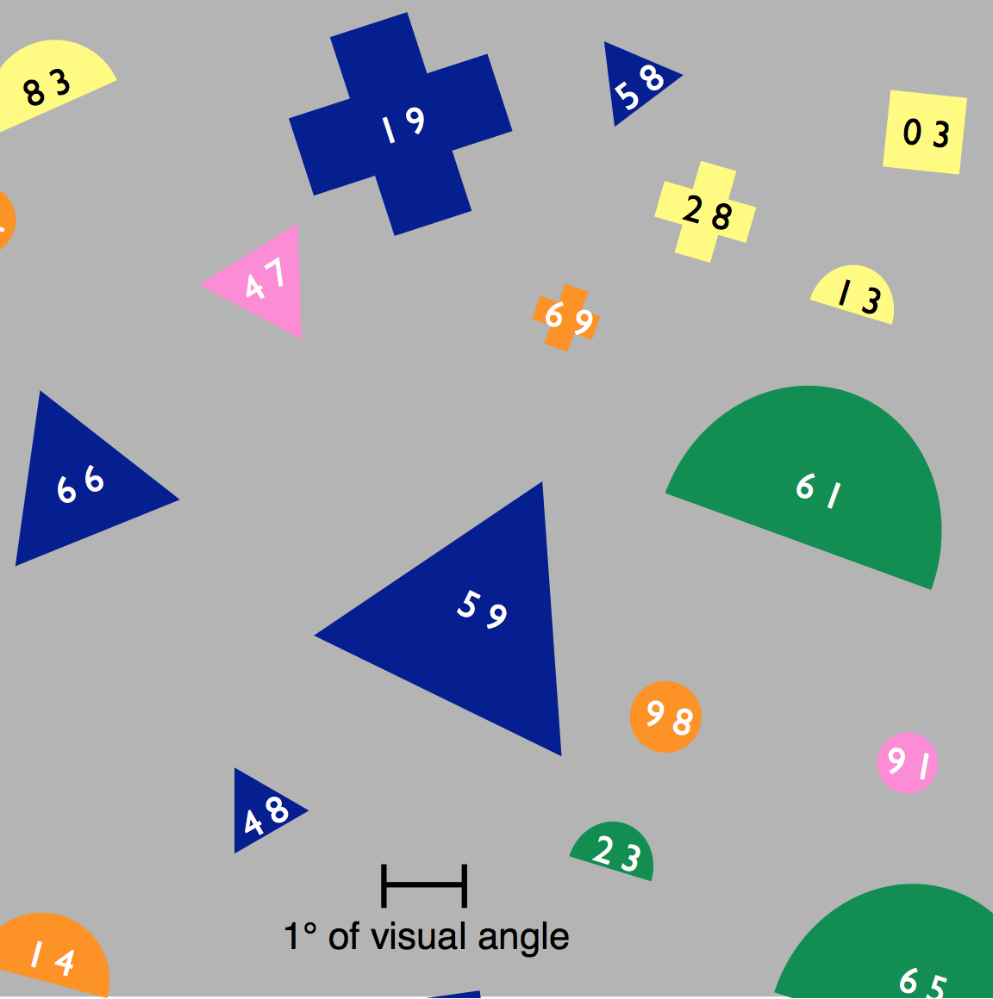
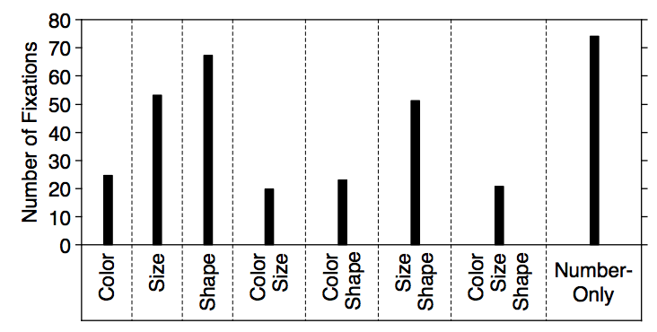
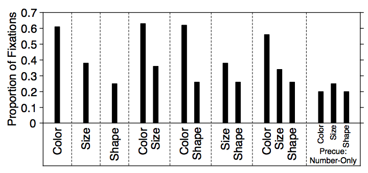

Google's new icons have been making the rounds lately. They have decided to rebrand the icons for the products, opting for consistency over individuality. Here's a before and after of what they have done:

You can tell from the title of this post that I dislike the redesign but let's try and empathise for a second. Design changes are almost always met with backlash. Remember when [Instagram's logo shifted from skeuomorphism to a modern flat style](https://www.theguardian.com/technology/2016/may/11/instagram-new-logo-photo-sharing-app)? Or when after one week of complaints since updating their logo, [Gap reverted to their old branding](https://www.vanityfair.com/culture/2010/10/new-gap-logo-despised-symbol-of-corporate-banality-dead-at-one-week). Even when [Snapchat simply increased the stroke width of its icon](https://www.fastcompany.com/90389667/the-real-reason-snap-changed-its-logo), many complained. Sure it can be difficult for customers to adjust when companies adjust their brand identity. However, this time I can explain why Google's decision was a bad idea.

Within computer science, the field of human-computer interaction (HCI) looks upon the design of computer technology and how we interact with these devices. Often studied within HCI is visual search, the perceptual task of scanning an environment and finding an object or feature. One such example of a task may be to find Google Calendar on your phone's home screen.

In one visual search study, an experiment was carried out where participants were tasked with locating an object with a two-digit label. There were 100 objects in total that were made up of combinations of 4 sizes, 5 colours and 5 shapes. Participant's eyes were tracked as they were presented with a cue that varied from simply "48" to "blue triangle 48". Once the participant found the object they pressed a button. The researcher hypothesised that if the cue was effective, there would be more fixations on objects with the cue's features.

The results from the study indicate that in a cue, colour was by far the most effective at helping a participant find an object. Colour required less total fixations and resulted in the highest proportion of fixations on matching objects. Size was not as helpful as colour and shape was the least helpful. The outcomes of the study can be seen below. You can see the differences in cues that only included either colour, size or shape. When combinations of features were used, if colour was given the size or shape provided had little significance in results. Likewise, if size was given, the shape provided had little significance.

Now we understand a little about visual search and how colour, size and shape affect our ability to find an object, let's have a look at Google's new icons again. We can consider the results in a hierarchy, where colour is most important, then size and lastly shape. Google's off to a very bad start because all these icons use the same colours: blue, red, green and yellow. Next lets look at size. Considering all app icons have the same size no one icon will be easier to find than others. Shape is where these icons become distinct. Given we know that shape is the most difficult feature to distinguish, these icons are not fit for purpose.

You could argue that this doesn't matter, however well thought out designs are what delights users. It's the small considerations that matter and complete a user's experience with your service. I'm sure you have had an experience where you're in a rush and struggle to find a particular app on your home screen. We should use this research to design better icons and build better experiences for users. Be better than Google.

Do you have any opinions on this topic? Let talk on Twitter [@pav_sidhu](https://twitter.com/pav_sidhu).

## References

Kieras, D.E. and Hornof, A.J. (2014). Towards accurate and practical predictive models of active-vision-based visual search. Proceedings of the 32nd annual ACM conference on Human factors in computing systems - CHI ’14.

‌Williams, L. G. (1966). A Study Of Visual Search Using Eye Movement Recordings. Technical Report, Honeywell Inc., St. Paul Minnesota, Feb. 28, 1966. NTIS AD0629624.
